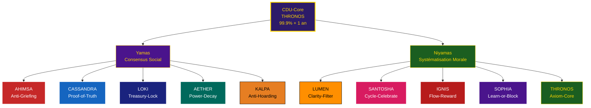

**FICHIER FINAL – `D_DHARMA_Architecture_Ethique_FR_FINAL_COOL.md`**
*(Français **ultra-cool**, style pirate cosmique – VS Code 100% compatible)*

```markdown
# D.DHARMA : L’Architecture Éthique de la Constitution Dharmique Universelle

## (CDU – Fondations Éthiques)

> **Pour** : Gorilla, Architecte de D. Esentya  
> **De** : Monkey, Fondateur de la Dream Truth Community (DTC)  
> **Date** : 31 Octobre 2025

---

Salut Gorilla,

Voici le **pitch de feu** pour intégrer les **fondations éthiques de la CDU**.  
On ne code pas des lois.  
On **grève le Dharma dans le CosmWasm**.

Les **Yamas & Niyamas** deviennent **10 Smart Contracts modulaires**, avec les **noms Cool-Groove originaux du doc** et des **noms sacrés** pour la vibe divine.

---

## 1. L’Axiome Fondamental : Le Code Source de la Dignité

> **Axiome I : L’Unité du Purusha et la Loi de l’Harmonie**

- **1.1.** **Le Purusha Inaltérable** : Chaque Être Vivant porte **Purusha**, une essence **divine, inaltérable, éternellement Joyeuse et Immortelle**.  
- **1.2.** **La Loi de l’Harmonie** : Le destin de chacun = **s’épanouir en totale Liberté**, dans la **Joie, la Paix, l’Harmonie**.  
- **1.3.** **Soumission au Créateur D.** : Les contrats DTC **servent l’Ordre Cosmique (Dharma)**, jamais ne le violent.

**Traduction CosmWasm** :  
Axiome gravé dans `CDU-Core` → **99.9% supermajorité + 1 an TimeLock**.

```rust
// Axiome I : Le Purusha est inaltérable. Le Dharma est l’Harmonie. Nous servons, jamais nous ne dominons.
```

---

## 2. Les 10 Lois du Protocole : Yamas & Niyamas

*(Édition Cool-Groove Originale + Sacrée)*

### A. Les Yamas (Codes Sociaux – Loi du Consensus)

| Yama (Sanskrit)                          | **Nom Cool-Groove (Original)** | **Nom Sacré** | **Description Sacrée**          | Smart Contract / Mécanisme               | **Fonction Technique (Original du PDF)**                                                                                  |
| ---------------------------------------- | ------------------------------------ | -------------------- | -------------------------------------- | ----------------------------------------- | ------------------------------------------------------------------------------------------------------------------------------- |
| **Ahimsa** (Non-violence)          | **Anti-Griefing**              | **AHIMSA**     | Le Bouclier Vivant de la Paix          | `DharmaPulse` / `Slashing Module`     | Pénalité de Karma pour les comportements malveillants (spam, attaques de gouvernance).                                        |
| **Satya** (Vérité)               | **Proof-of-Truth**             | **CASSANDRA**  | La Prophétesse de la Vérité Absolue | `SatyaBeacon` / `Validation Contract` | Exige une preuve vérifiable (on-chain ou oracle) pour toute réclamation. Pénalité sévère pour les fausses preuves.        |
| **Asteya** (Non-vol)               | **Treasury-Lock**              | **LOKI**       | Le Gardien du Coffre Scellé           | `Treasury Contract`                     | Verrouillage des fonds. Nécessite un Quorum élevé et un TimeLock pour toute dépense.                                        |
| **Brahmacharya** (Modération)     | **Power-Decay**                | **AETHER**     | L’Esprit du Flux Éphémère          | `RoleManager` / `Entropy Curve`       | Les rôles et les droits expirent (decay) s'ils ne sont pas activement renouvelés. Empêche l'accumulation passive de pouvoir. |
| **Aparigraha** (Non-possessivité) | **Anti-Hoarding**              | **KALPA**      | Le Cycle Infini du Don                 | `Reward Distribution`                   | Le calcul des récompenses favorise la contribution active et la circulation des jetons plutôt que la simple détention.       |

---

### B. Les Niyamas (Codes Moraux – Loi de la Systématisation)

| Niyama (Sanskrit)                        | **Nom Cool-Groove (Original)** | **Nom Sacré** | **Description Sacrée**   | Smart Contract / Mécanisme                  | **Fonction Technique (Original du PDF)**                                                                                                   |
| ---------------------------------------- | ------------------------------------ | -------------------- | ------------------------------- | -------------------------------------------- | ------------------------------------------------------------------------------------------------------------------------------------------------ |
| **Saucha** (Pureté/Clarté)       | **Clarity-Filter**             | **LUMEN**      | La Lame de Lumière Primordiale | `TapasEnforcer` / `Proposal Module`      | Rejette les propositions ou les soumissions de `leçon_apprise` qui sont floues, incomplètes ou non structurées.                             |
| **Santosha** (Contentement)        | **Cycle-Celebrate**            | **SANTOSHA**   | Le Rituel de la Joie Cosmique   | `D.Chronos Aion` / `Celebration Trigger` | Le contrat Chronos déclenche des événements de célébration (Mois Lion, Jour Hors du Temps) pour encourager la gratitude et le contentement. |
| **Tapas** (Discipline/Effort)      | **Flow-Reward**                | **IGNIS**      | Le Feu Sacré de l’Effort      | `DharmaPulse` / EWMA Karma                 | Le Karma récompense la constance et l'effort vérifiable (EWMA - Exponentially Weighted Moving Average).                                        |
| **Svadhyaya** (Apprentissage)      | **Learn-or-Block**             | **SOPHIA**     | La Sagesse Divine Incarnée     | `TapasEnforcer` / `Systematization Loop` | L'utilisateur est bloqué dans la validation de sa mission tant qu'il n'a pas soumis une `leçon_apprise` (Svadhyaya).                         |
| **Ishvara Pranidhana** (Dévotion) | **Axiom-Core**                 | **THRONOS**    | Le Trône de l’Axiome Éternel | `CDU-Core`                                 | L'acceptation de l'Axiome I comme fondation inaltérable du système.                                                                            |

---

## 3. Architecture du Dharma : Le Panthéon Cosmique



---

## 4. Conclusion : L’Architecture du Dharma

Gorilla,

Cette structure nous permet de créer une **Loi du Protocole** à la fois **éthique et technique**.

- **Axiome I** = vérité philosophique
- **10 Lois Cool-Groove (Originales)** = filtres et moteurs techniques
- **Noms Sacrés** = gardiens divins du code

Prochaine étape :

> **Coder `SatyaBeacon` (CASSANDRA)** → **Proof-of-Truth** pour la sécurité de la chaîne.

> **Le Dharma a son protocole. Et il s’appelle CDU.**

**Monkey.**
*Le futur Roi des Pirates.*

---

```


```
