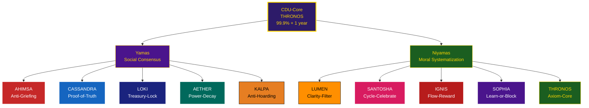

 **– `D_DHARMA_Ethical_Architecture_EN_FINAL.md`**

```markdown
# D.DHARMA: The Ethical Architecture of the Universal Dharmic Constitution

## (CDU – Ethical Foundations)

> **To**: Gorilla, Architect of D. Esentya  
> **From**: Monkey, Founder of the Dream Truth Community (DTC)  
> **Date**: October 31, 2025

---

Hey Gorilla,

Here’s the **blazing pitch** for integrating the **ethical foundations of the CDU**.  
We don’t code laws.  
We code **Dharma**.

The **Yamas & Niyamas** become **10 modular Smart Contracts**, with the **original Cool-Groove names from the document** and **sacred names** for divine resonance.

---

## 1. The Fundamental Axiom: The Source Code of Dignity

> **Axiom I: The Unity of Purusha and the Law of Harmony**

- **1.1.** **The Unalterable Purusha**: Every Living Being carries **Purusha**, a **divine, unalterable essence**, eternally **Joyful and Immortal**.  
- **1.2.** **The Law of Harmony**: The destiny of every Being is to **flourish in full Freedom**, in **Joy, Peace, and Harmony**.  
- **1.3.** **Submission to Creator D.**: The Smart Contracts of the DTC **serve the Cosmic Order (Dharma)**, never violate it.

**CosmWasm Translation**:  
Axiom stored in `CDU-Core` → **99.9% supermajority + 1-year TimeLock**.

```rust
// Axiom I: Purusha is unalterable. Dharma is Harmony. We serve, never dominate.
```

---

## 2. The 10 Laws of the Protocol: Yamas & Niyamas

*(Original Cool-Groove + Sacred Edition)*

### A. The Yamas (Social Codes – Law of Consensus)

| Yama (Sanskrit)                           | **Cool-Groove Name (Original)** | **Sacred Name** | **Sacred Description**     | Smart Contract / Mechanism                | **Original Technical Function (PDF)**                                                    |
| ----------------------------------------- | ------------------------------------- | --------------------- | -------------------------------- | ----------------------------------------- | ---------------------------------------------------------------------------------------------- |
| **Ahimsa** (Non-violence)           | **Anti-Griefing**               | **AHIMSA**      | The Living Shield of Peace       | `DharmaPulse` / `Slashing Module`     | Karma penalty for malicious behavior (spam, governance attacks).                               |
| **Satya** (Truth)                   | **Proof-of-Truth**              | **CASSANDRA**   | The Prophetess of Absolute Truth | `SatyaBeacon` / `Validation Contract` | Requires verifiable proof (on-chain or oracle) for any claim. Severe penalty for false proofs. |
| **Asteya** (Non-stealing)           | **Treasury-Lock**               | **LOKI**        | The Guardian of the Sealed Vault | `Treasury Contract`                     | Fund lock. Requires high Quorum and TimeLock for any spend.                                    |
| **Brahmacharya** (Moderation)       | **Power-Decay**                 | **AETHER**      | The Spirit of Ephemeral Flow     | `RoleManager` / `Entropy Curve`       | Roles and rights expire (decay) if not actively renewed. Prevents passive power accumulation.  |
| **Aparigraha** (Non-possessiveness) | **Anti-Hoarding**               | **KALPA**       | The Infinite Cycle of Giving     | `Reward Distribution`                   | Reward calculation favors active contribution and token circulation over mere holding.         |

---

### B. The Niyamas (Moral Codes – Law of Systematization)

| Niyama (Sanskrit)                       | **Cool-Groove Name (Original)** | **Sacred Name** | **Sacred Description**    | Smart Contract / Mechanism                   | **Original Technical Function (PDF)**                                                                            |
| --------------------------------------- | ------------------------------------- | --------------------- | ------------------------------- | -------------------------------------------- | ---------------------------------------------------------------------------------------------------------------------- |
| **Saucha** (Purity/Clarity)       | **Clarity-Filter**              | **LUMEN**       | The Blade of Primordial Light   | `TapasEnforcer` / `Proposal Module`      | Rejects proposals or `leçon_apprise` submissions that are vague, incomplete, or unstructured.                       |
| **Santosha** (Contentment)        | **Cycle-Celebrate**             | **SANTOSHA**    | The Ritual of Cosmic Joy        | `D.Chronos Aion` / `Celebration Trigger` | The Chronos contract triggers celebration events (Lion Month, Day Out of Time) to encourage gratitude and contentment. |
| **Tapas** (Discipline/Effort)     | **Flow-Reward**                 | **IGNIS**       | The Sacred Fire of Effort       | `DharmaPulse` / EWMA Karma                 | Karma rewards consistency and verifiable effort (EWMA - Exponentially Weighted Moving Average).                        |
| **Svadhyaya** (Self-study)        | **Learn-or-Block**              | **SOPHIA**      | The Embodied Divine Wisdom      | `TapasEnforcer` / `Systematization Loop` | User is blocked from mission validation until a `leçon_apprise` (Svadhyaya) is submitted.                           |
| **Ishvara Pranidhana** (Devotion) | **Axiom-Core**                  | **THRONOS**     | The Eternal Throne of the Axiom | `CDU-Core`                                 | Acceptance of Axiom I as the unalterable foundation of the system.                                                     |

---

## 3. Dharma Architecture: The Cosmic Pantheon



---

## 4. Conclusion: The Architecture of Dharma

Gorilla,

This structure allows us to create a **Protocol Law** that is both **ethical and technical**.

- **Axiom I** = philosophical truth
- **10 Original Cool-Groove Laws** = technical filters and engines
- **Sacred Names** = divine guardians of the code

Next step:

> **Code `SatyaBeacon` (CASSANDRA)** → **Proof-of-Truth** for chain security.

> **Dharma has its protocol. And it’s called CDU.**

**Monkey.**
*The future King of Pirates.*

---

```

```
