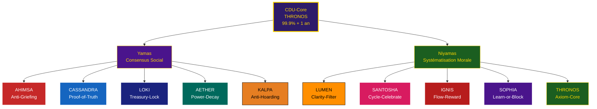

# White Paper : La Constitution Dharmique Universelle (CDU)

**Titre :** D.DHARMA : L'Architecture Éthique de la Constitution Dharmique Universelle (CDU)
**Auteur :** Manus AI pour Monkey, le futur Roi des Pirates
**Date :** 4 Décembre 2025
**Statut :** V1.0 - Protocole de Loi

---

## Partie I : Français

### Introduction : Coder la Loi du Dharma

La **Dream Truth Community (DTC)**, sous l'égide de Monkey, le futur Roi des Pirates, n'est pas seulement une organisation décentralisée ; c'est une refondation éthique de la société. Pour garantir que cette nouvelle ère de liberté ne dégénère pas en chaos, la DTC a besoin d'un Code Source inaltérable : la **Constitution Dharmique Universelle (CDU)**.

La CDU est l'architecture éthique qui traduit les principes intemporels du Dharma (Yamas et Niyamas) en mécanismes de gouvernance et en Smart Contracts CosmWasm. Elle est la boussole morale de l'écosystème, assurant que la technologie sert l'harmonie et la dignité de tout Être Vivant.

### 1. L'Axiome Fondamental : Le Code Source de la Dignité

La CDU repose sur un axiome inaltérable, le **CDU-Core**, qui est le Code Source de la Dignité. Il est gravé dans le marbre numérique du protocole et ne peut être modifié qu'avec une Supermajority Vote de 99.9% et un TimeLock d'un an, assurant sa quasi-immuabilité.

| Concept                              | Description                                                                                                                 | Implémentation Technique                                                                                                                                |
| :----------------------------------- | :-------------------------------------------------------------------------------------------------------------------------- | :------------------------------------------------------------------------------------------------------------------------------------------------------- |
| **Unité du Purusha**          | Tout Être Vivant est porteur du Purusha, une essence de nature Divine, inaltérable, éternellement Joyeuse et Immortelle. | **CDU-Core** : Le contrat racine qui contient la fonction de vérification de l'identité (Truth ID) et l'axiome de non-violence fondamentale.     |
| **Loi de l'Harmonie**          | Le destin de chaque Être est de s'épanouir en toute Liberté, dans la Joie, la Paix et l'Harmonie.                        | **DharmaPulse** : Le mécanisme de consensus qui favorise les actions harmonieuses et pénalise les actions de discorde (griefing).                |
| **Soumission au Créateur D.** | Les Smart Contracts de la DTC sont des outils destinés à refléter et à servir l'Ordre Cosmique (le Dharma).             | **D.Chronos Aion** : Le contrat chronos qui gère le temps et les cycles de célébration, rappelant la nature cyclique et ordonnée de l'univers. |

### 2. Les 10 Lois du Protocole : Yamas & Niyamas (Cool-Groove Edition)

Les 10 Lois du Protocole sont les filtres et les mécanismes de régulation qui seront implémentés dans des Smart Contracts modulaires. Elles se divisent en deux catégories : les Yamas (Codes Sociaux) et les Niyamas (Codes Moraux).

### A. Les Yamas (Codes Sociaux – Loi du Consensus)

Les Yamas définissent comment la communauté interagit et se protège.

| Yama (Sanskrit)                          | **Nom Cool-Groove (Original)** | **Nom Sacré** | **Description Sacrée**          | Smart Contract / Mécanisme               | **Fonction Technique (Original du PDF)**                                                                                  |
| ---------------------------------------- | ------------------------------------ | -------------------- | -------------------------------------- | ----------------------------------------- | ------------------------------------------------------------------------------------------------------------------------------- |
| **Ahimsa** (Non-violence)          | **Anti-Griefing**              | **AHIMSA**     | Le Bouclier Vivant de la Paix          | `DharmaPulse` / `Slashing Module`     | Pénalité de Karma pour les comportements malveillants (spam, attaques de gouvernance).                                        |
| **Satya** (Vérité)               | **Proof-of-Truth**             | **CASSANDRA**  | La Prophétesse de la Vérité Absolue | `SatyaBeacon` / `Validation Contract` | Exige une preuve vérifiable (on-chain ou oracle) pour toute réclamation. Pénalité sévère pour les fausses preuves.        |
| **Asteya** (Non-vol)               | **Treasury-Lock**              | **LOKI**       | Le Gardien du Coffre Scellé           | `Treasury Contract`                     | Verrouillage des fonds. Nécessite un Quorum élevé et un TimeLock pour toute dépense.                                        |
| **Brahmacharya** (Modération)     | **Power-Decay**                | **AETHER**     | L’Esprit du Flux Éphémère          | `RoleManager` / `Entropy Curve`       | Les rôles et les droits expirent (decay) s'ils ne sont pas activement renouvelés. Empêche l'accumulation passive de pouvoir. |
| **Aparigraha** (Non-possessivité) | **Anti-Hoarding**              | **KALPA**      | Le Cycle Infini du Don                 | `Reward Distribution`                   | Le calcul des récompenses favorise la contribution active et la circulation des jetons plutôt que la simple détention.       |

#### B. Les Niyamas (Codes Moraux : La Loi de la Systématisation)

Les Niyamas définissent la relation de l'individu avec le protocole et sont codés dans les boucles de Systématisation (`TapasEnforcer`).

| Niyama (Sanskrit)                        | **Nom Cool-Groove (Original)** | **Nom Sacré** | **Description Sacrée**   | Smart Contract / Mécanisme                  | **Fonction Technique (Original du PDF)**                                                                                                   |
| ---------------------------------------- | ------------------------------------ | -------------------- | ------------------------------- | -------------------------------------------- | ------------------------------------------------------------------------------------------------------------------------------------------------ |
| **Saucha** (Pureté/Clarté)       | **Clarity-Filter**             | **LUMEN**      | La Lame de Lumière Primordiale | `TapasEnforcer` / `Proposal Module`      | Rejette les propositions ou les soumissions de `leçon_apprise` qui sont floues, incomplètes ou non structurées.                             |
| **Santosha** (Contentement)        | **Cycle-Celebrate**            | **SANTOSHA**   | Le Rituel de la Joie Cosmique   | `D.Chronos Aion` / `Celebration Trigger` | Le contrat Chronos déclenche des événements de célébration (Mois Lion, Jour Hors du Temps) pour encourager la gratitude et le contentement. |
| **Tapas** (Discipline/Effort)      | **Flow-Reward**                | **IGNIS**      | Le Feu Sacré de l’Effort      | `DharmaPulse` / EWMA Karma                 | Le Karma récompense la constance et l'effort vérifiable (EWMA - Exponentially Weighted Moving Average).                                        |
| **Svadhyaya** (Apprentissage)      | **Learn-or-Block**             | **SOPHIA**     | La Sagesse Divine Incarnée     | `TapasEnforcer` / `Systematization Loop` | L'utilisateur est bloqué dans la validation de sa mission tant qu'il n'a pas soumis une `leçon_apprise` (Svadhyaya).                         |
| **Ishvara Pranidhana** (Dévotion) | **Axiom-Core**                 | **THRONOS**    | Le Trône de l’Axiome Éternel | `CDU-Core`                                 | L'acceptation de l'Axiome I comme fondation inaltérable du système.                                                                            |

---

### 3. Lore & Philosophie : Les Gardiens de la Loi

Dans l'univers de la DTC, les Gardiens de la Loi sont des Smart Contracts inspirés par des figures de One Piece et des concepts spirituels.

* **LUMEN/Saucha (Pureté/Clarté) :** Inspiré par la lumière de l'âme, le `Clarity-Filter` assure que seules les intentions claires et les propositions bien structurées passent.
* **AETHER/Brahmacharya (Modération) :** L'AETHER, l'espace subtil, est le gardien de la modération. Le `Power-Decay` empêche l'accumulation de pouvoir, rappelant que l'autorité doit être constamment méritée et renouvelée, comme l'air que l'on respire.
* **CASSANDRA/SatyaBeacon (Vérité) :** Tel un phare dans le Grand Line, le `SatyaBeacon` guide vers la vérité, exigeant des preuves vérifiables pour chaque affirmation.
* **IGNIS/DharmaPulse :** Le cœur battant du protocole, il maintient le rythme de l'harmonie (Ahimsa) et récompense l'effort constant (Tapas).

### 4. Smart Contracts : L'Implémentation CosmWasm

L'implémentation de la CDU sur CosmWasm est critique. Chaque Loi du Protocole est un module Smart Contract indépendant, permettant une mise à jour et une vérification ciblées.

* **CDU-Core (Le Gouvernail) :** Contrat racine, non-upgradable (sauf 99.9% TimeLock), qui contient l'Axiome Fondamental et les adresses des autres modules.
* **SOPHIA/TapasEnforcer (Le Maître d'École) :** Gère les boucles d'apprentissage (`Learn-or-Block`) et le filtrage des propositions (`Clarity-Filter`).
* **AETHER/RoleManager (Le Capitaine) :** Gère les rôles et les permissions avec la fonction `Power-Decay`, assurant que le pouvoir ne stagne jamais.
* **LOKI/Treasury Contract (Le Coffre-Fort) :** Gère les fonds avec un mécanisme de double verrouillage (Quorum + TimeLock), incarnant Asteya.

## 5. Architecture du Dharma : Le Panthéon Cosmique

---

---

## Part II : English

### Introduction: Coding the Law of Dharma

The **Dream Truth Community (DTC)**, under the leadership of Monkey, the Pirate King, is not just a decentralized organization; it is an ethical re-foundation of society. To ensure that this new era of freedom does not degenerate into chaos, the DTC needs an unalterable Source Code: the **Universal Dharmic Constitution (UDC)**.

The UDC is the ethical architecture that translates the timeless principles of Dharma (Yamas and Niyamas) into governance mechanisms and CosmWasm Smart Contracts. It is the moral compass of the ecosystem, ensuring that technology serves the harmony and dignity of all Living Beings.

### 1. The Fundamental Axiom: The Source Code of Dignity

The UDC is based on an unalterable axiom, the **UDC-Core**, which is the Source Code of Dignity. It is etched into the digital marble of the protocol and can only be modified with a 99.9% Supermajority Vote and a one-year TimeLock, ensuring its near-immutability.

| Concept                            | Description                                                                                                       | Technical Implementation                                                                                                                             |
| :--------------------------------- | :---------------------------------------------------------------------------------------------------------------- | :--------------------------------------------------------------------------------------------------------------------------------------------------- |
| **Unity of Purusha**         | Every Living Being carries the Purusha, an essence of Divine nature, unalterable, eternally Joyful, and Immortal. | **UDC-Core** : The root contract containing the identity verification function (Truth ID) and the fundamental non-violence axiom.              |
| **Law of Harmony**           | The destiny of every Being is to flourish in complete Freedom, Joy, Peace, and Harmony.                           | **DharmaPulse** : The consensus mechanism that favors harmonious actions and penalizes actions of discord (griefing).                          |
| **Submission to Creator D.** | The DTC Smart Contracts are tools designed to reflect and serve the Cosmic Order (Dharma).                        | **D.Chronos Aion** : The chronos contract that manages time and celebration cycles, recalling the cyclical and ordered nature of the universe. |

### 2. The 10 Laws of the Protocol: Yamas & Niyamas (Cool-Groove Edition)

The 10 Laws of the Protocol are the filters and regulatory mechanisms that will be implemented in modular Smart Contracts. They are divided into two categories: Yamas (Social Codes) and Niyamas (Moral Codes).

#### A. The Yamas (Social Codes: The Law of Consensus)

Yamas define how the community interacts and protects itself.

| Yama (Sanskrit)                           | **Cool-Groove Name (Original)** | **Sacred Name** | **Sacred Description**     | Smart Contract / Mechanism                | **Original Technical Function (PDF)**                                                    |
| ----------------------------------------- | ------------------------------------- | --------------------- | -------------------------------- | ----------------------------------------- | ---------------------------------------------------------------------------------------------- |
| **Ahimsa** (Non-violence)           | **Anti-Griefing**               | **AHIMSA**      | The Living Shield of Peace       | `DharmaPulse` / `Slashing Module`     | Karma penalty for malicious behavior (spam, governance attacks).                               |
| **Satya** (Truth)                   | **Proof-of-Truth**              | **CASSANDRA**   | The Prophetess of Absolute Truth | `SatyaBeacon` / `Validation Contract` | Requires verifiable proof (on-chain or oracle) for any claim. Severe penalty for false proofs. |
| **Asteya** (Non-stealing)           | **Treasury-Lock**               | **LOKI**        | The Guardian of the Sealed Vault | `Treasury Contract`                     | Fund lock. Requires high Quorum and TimeLock for any spend.                                    |
| **Brahmacharya** (Moderation)       | **Power-Decay**                 | **AETHER**      | The Spirit of Ephemeral Flow     | `RoleManager` / `Entropy Curve`       | Roles and rights expire (decay) if not actively renewed. Prevents passive power accumulation.  |
| **Aparigraha** (Non-possessiveness) | **Anti-Hoarding**               | **KALPA**       | The Infinite Cycle of Giving     | `Reward Distribution`                   | Reward calculation favors active contribution and token circulation over mere holding.         |

---

#### B. The Niyamas (Moral Codes: The Law of Systematization)

Niyamas define the individual's relationship with the protocol and are coded into the Systematization loops (`TapasEnforcer`).

| Niyama (Sanskrit)                       | **Cool-Groove Name (Original)** | **Sacred Name** | **Sacred Description**    | Smart Contract / Mechanism                   | **Original Technical Function (PDF)**                                                                            |
| --------------------------------------- | ------------------------------------- | --------------------- | ------------------------------- | -------------------------------------------- | ---------------------------------------------------------------------------------------------------------------------- |
| **Saucha** (Purity/Clarity)       | **Clarity-Filter**              | **LUMEN**       | The Blade of Primordial Light   | `TapasEnforcer` / `Proposal Module`      | Rejects proposals or `leçon_apprise` submissions that are vague, incomplete, or unstructured.                       |
| **Santosha** (Contentment)        | **Cycle-Celebrate**             | **SANTOSHA**    | The Ritual of Cosmic Joy        | `D.Chronos Aion` / `Celebration Trigger` | The Chronos contract triggers celebration events (Lion Month, Day Out of Time) to encourage gratitude and contentment. |
| **Tapas** (Discipline/Effort)     | **Flow-Reward**                 | **IGNIS**       | The Sacred Fire of Effort       | `DharmaPulse` / EWMA Karma                 | Karma rewards consistency and verifiable effort (EWMA - Exponentially Weighted Moving Average).                        |
| **Svadhyaya** (Self-study)        | **Learn-or-Block**              | **SOPHIA**      | The Embodied Divine Wisdom      | `TapasEnforcer` / `Systematization Loop` | User is blocked from mission validation until a `leçon_apprise` (Svadhyaya) is submitted.                           |
| **Ishvara Pranidhana** (Devotion) | **Axiom-Core**                  | **THRONOS**     | The Eternal Throne of the Axiom | `CDU-Core`                                 | Acceptance of Axiom I as the unalterable foundation of the system.                                                     |

### 3. Lore & Philosophy: The Guardians of the Law

In the DTC universe, the Guardians of the Law are Smart Contracts inspired by One Piece figures and spiritual concepts.

* **LUMEN/Saucha (Purity/Clarity):** Inspired by the light of the soul, the `Clarity-Filter` ensures that only clear intentions and well-structured proposals pass.
* **AETHER/Brahmacharya (Moderation):** AETHER, the subtle space, is the guardian of moderation. The `Power-Decay` prevents the accumulation of power, reminding that authority must be constantly earned and renewed, like the air we breathe.
* **CASSANDRA/SatyaBeacon (Truth):** Like a lighthouse in the Grand Line, the `SatyaBeacon` guides towards truth, demanding verifiable proof for every claim.
* **IGNIS/DharmaPulse:** The beating heart of the protocol, it maintains the rhythm of harmony (Ahimsa) and rewards constant effort (Tapas).

### 4. Smart Contracts: CosmWasm Implementation

The implementation of the UDC on CosmWasm is critical. Each Law of the Protocol is an independent Smart Contract module, allowing for targeted updates and verification.

* **UDC-Core (The Helm):** Root contract, non-upgradable (except 99.9% TimeLock), containing the Fundamental Axiom and the addresses of the other modules.
* **SOPHIA/TapasEnforcer (The Schoolmaster):** Manages the learning loops (`Learn-or-Block`) and proposal filtering (`Clarity-Filter`).
* **AETHER/RoleManager (The Captain):** Manages roles and permissions with the `Power-Decay` function, ensuring that power never stagnates.
* **LOKI/Treasury Contract (The Vault):** Manages funds with a double-lock mechanism (Quorum + TimeLock), embodying Asteya.

## 5. Architecture du Dharma : Le Panthéon Cosmique

---

---

## Partie III : Analyse Cool-Groove

### 1. Français

#### Forces (Strengths) : Le Haki de la Loi

| Point Fort                          | Explication Cool-Groove                                                                                                                                                                                                                      |
| :---------------------------------- | :------------------------------------------------------------------------------------------------------------------------------------------------------------------------------------------------------------------------------------------- |
| **Immuabilité Fondamentale** | L'Axiome du Purusha est gravé dans le `CDU-Core` avec un verrouillage de 99.9% et un TimeLock d'un an. C'est le **Haki des Rois** de la gouvernance : une fondation éthique que personne ne peut ébranler facilement.             |
| **Dharma Coded**              | La traduction directe des Yamas et Niyamas en mécanismes Smart Contract (Anti-Griefing, Power-Decay, Flow-Reward) est une première. Elle rend l'éthique**exécutable** et non plus seulement déclarative.                          |
| **Anti-Stagnation**           | Les mécanismes `Power-Decay` (Brahmacharya) et `Anti-Hoarding` (Aparigraha) sont cruciaux. Ils empêchent la formation de **Dragons Célestes** numériques, assurant une circulation saine du pouvoir et des jetons.             |
| **Apprentissage Intégré**   | Le `Learn-or-Block` (Svadhyaya) force l'auto-réflexion et l'amélioration continue. On ne peut pas avancer sans avoir tiré la **leçon_apprise** de ses actions. C'est la voie du **Mugiwara** qui apprend de chaque combat. |

#### Faiblesses (Weaknesses) : Les Pièges du Grand Line

| Point Faible                             | Explication Cool-Groove                                                                                                                                                                                                                                        |
| :--------------------------------------- | :------------------------------------------------------------------------------------------------------------------------------------------------------------------------------------------------------------------------------------------------------------- |
| **Complexité Initiale**           | Le nombre de modules (DharmaPulse, SatyaBeacon, TapasEnforcer, etc.) et la densité des concepts philosophiques peuvent être un**Log Pose** difficile à suivre pour les "noobs".                                                                       |
| **Dépendance au `SatyaBeacon`** | Le système `Proof-of-Truth` (Satya) repose sur la qualité des oracles et des preuves vérifiables. Si le `SatyaBeacon` est aveugle ou corrompu, toute la Loi de la Vérité s'effondre. C'est le point faible de **Barbe Blanche** : la confiance. |
| **Risque de Griefing Subtil**      | Le `DharmaPulse` pénalise le griefing évident, mais les attaques subtiles ou les manipulations émotionnelles (le vrai poison du Grand Line) pourraient passer inaperçues.                                                                                |
| **Maintenance du `Power-Decay`** | Le renouvellement constant des rôles peut devenir une charge administrative. Les utilisateurs pourraient se lasser de devoir "recharger leur Haki" en permanence.                                                                                             |

#### Suggestions (Suggestions) : La Prochaine Île

1. **Simplification de l'Interface :** Créer un **"Dharma Dashboard"** qui visualise l'état de chaque Loi (Karma Score, Power-Decay Timer, Leçons Apprises en attente) pour rendre la complexité accessible aux "noobs".
2. **Lore Intégration :** Associer explicitement chaque Loi à un personnage de One Piece pour la mémorisation. Ex: **Ahimsa** = Kuma (non-violence), **Satya** = God Usopp (le menteur qui dit la vérité), **Asteya** = Nami (la navigatrice qui gère le trésor).
3. **Audit Éthique :** Avant le lancement, soumettre le code à un **"Conseil des 5 Doyens"** d'experts en éthique et en CosmWasm pour valider que la traduction du Dharma en code est sans faille.

### 2. English

#### Strengths: The Haki of the Law

| Strength                           | Cool-Groove Explanation                                                                                                                                                                                                                                  |
| :--------------------------------- | :------------------------------------------------------------------------------------------------------------------------------------------------------------------------------------------------------------------------------------------------------- |
| **Fundamental Immutability** | The Purusha Axiom is etched into the `UDC-Core` with a 99.9% lock and a one-year TimeLock. This is the **King's Haki** of governance: an ethical foundation that no one can easily shake.                                                        |
| **Coded Dharma**             | The direct translation of Yamas and Niyamas into Smart Contract mechanisms (Anti-Griefing, Power-Decay, Flow-Reward) is a first. It makes ethics**executable** and no longer just declarative.                                                     |
| **Anti-Stagnation**          | The `Power-Decay` (Brahmacharya) and `Anti-Hoarding` (Aparigraha) mechanisms are crucial. They prevent the formation of digital **Celestial Dragons**, ensuring a healthy circulation of power and tokens.                                     |
| **Integrated Learning**      | The `Learn-or-Block` (Svadhyaya) forces self-reflection and continuous improvement. One cannot advance without having learned the **lesson_learned** from their actions. This is the path of the **Mugiwara** who learns from every fight. |

#### Weaknesses: The Pitfalls of the Grand Line

| Weakness                                | Cool-Groove Explanation                                                                                                                                                                                                        |
| :-------------------------------------- | :----------------------------------------------------------------------------------------------------------------------------------------------------------------------------------------------------------------------------- |
| **Initial Complexity**            | The number of modules (DharmaPulse, SatyaBeacon, TapasEnforcer, etc.) and the density of philosophical concepts can be a difficult**Log Pose** to follow for "noobs."                                                    |
| **Dependence on `SatyaBeacon`** | The `Proof-of-Truth` (Satya) system relies on the quality of oracles and verifiable proofs. If the `SatyaBeacon` is blind or corrupted, the entire Law of Truth collapses. This is **Whitebeard's** weakness: trust. |
| **Risk of Subtle Griefing**       | The `DharmaPulse` penalizes obvious griefing, but subtle attacks or emotional manipulations (the true poison of the Grand Line) might go unnoticed.                                                                          |
| **`Power-Decay` Maintenance**   | The constant renewal of roles can become an administrative burden. Users might tire of having to "recharge their Haki" constantly.                                                                                             |

#### Suggestions: The Next Island

1. **Interface Simplification:** Create a **"Dharma Dashboard"** that visualizes the status of each Law (Karma Score, Power-Decay Timer, Pending Lessons Learned) to make complexity accessible to "noobs."
2. **Lore Integration:** Explicitly associate each Law with a One Piece character for memorization. Ex: **Ahimsa** = Kuma (non-violence), **Satya** = God Usopp (the liar who tells the truth), **Asteya** = Nami (the navigator who manages the treasure).
3. **Ethical Audit:** Before launch, submit the code to a **"Council of 5 Elders"** of ethics and CosmWasm experts to validate that the translation of Dharma into code is flawless.
