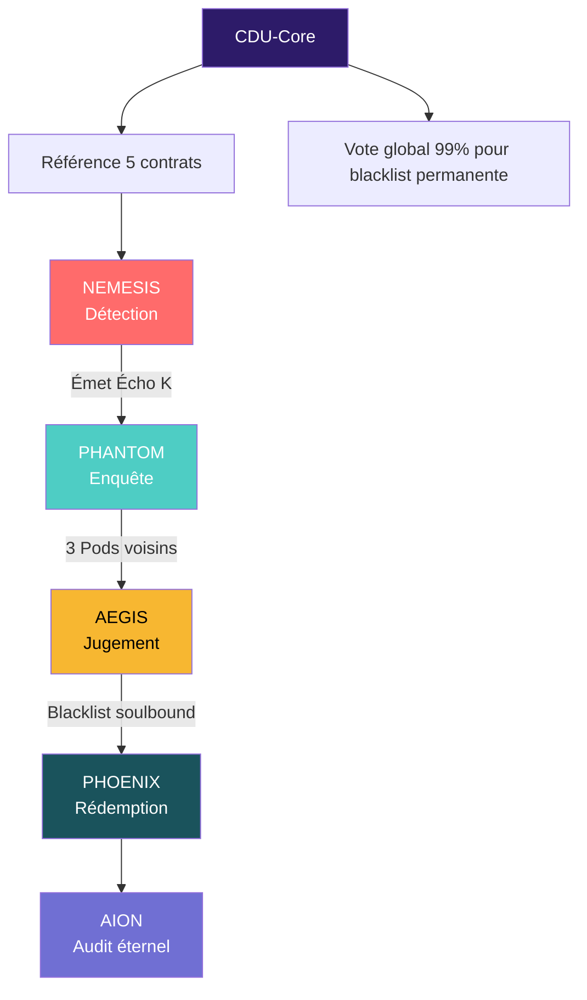

**FICHIER CORRIGÉ – `D_KARMA_POLICE_Architecture_Fractale.md`**

```markdown
# D.KARMA POLICE : L'Architecture Fractale de la Sécurité Dharmique Universelle

## (CDU – Module Sécurité)

> **Pour** : Gorilla, Architecte de D. Esentya  
> **De** : Monkey, Roi des Pirates de la Dream Truth Community (DTC)  
> **Date** : 31 Octobre 2025

---

Salut Gorilla,

Voici le **pitch de feu** pour la **D.Karma Police** – la première police décentralisée, **organisée par le peuple, pour le peuple**, et **codée dans le Dharma**.  
Pas de képi, pas de sirène.  
Juste des **Pods fractals**, du **Karma vivant**, et des **smart contracts qui cognent comme un boulet de canon cosmique**.

On ne code pas la répression.  
On code **l'Écho de la Vérité**.

---

## 1. L'Axiome de la D.Karma Police  
*(Le Code Source de la Justice)*

> **Axiome K : Le Karma est l'Écho du Dharma**
> - **1.1.** Le Karma n’est **pas une dette** – c’est la **trace vibratoire** de la contribution au Purusha collectif.  
> - **1.2.** Toute **violation du Dharma** (fraude, capture, griefing) crée un **Écho négatif** qui doit être **corrigé par la communauté**.  
> - **1.3.** La **D.Karma Police** est l’**organe immunitaire fractal** de la DTC – elle **détecte, isole, régénère**.

**Traduction CosmWasm** :  
Cet axiome est **gravé dans le CDU-Core** avec **99.9% supermajority + 1 an TimeLock**.  
Chaque contrat de la Police doit **citer cet axiome en commentaire** :

```rust
// Axiome K : Le Karma est l'Écho du Dharma – toute violation doit être corrigée par l'Écho collectif.
```

---

## 2. Les 5 Lois de la D.Karma Police

*(Cool-Groove Edition – Noms qui claquent)*

| Loi (Principe)            | Nom Cool-Groove   | Smart Contract     | Fonction Technique                                       |
| ------------------------- | ----------------- | ------------------ | -------------------------------------------------------- |
| **Détection**      | **NEMESIS** | `NemesisBeacon`  | Signalement anonyme + preuve ZK. Karma minimum 15.       |
| **Enquête**        | **PHANTOM** | `PhantomPod`     | Écho cross-Pod (3 Pods voisins). Vote fractale.         |
| **Validation**      | **AEGIS**   | `AegisValidator` | Quorum 66% + diversité géo/karma. Blacklist soulbound. |
| **Régénération** | **PHOENIX** | `PhoenixRitual`  | Renewal après 28 jours + leçon_apprise.                |
| **Mémoire**        | AION              | `AionEcho`       | Audit trail immutable. Decay des signalements inactifs.  |

---

## 3. Architecture Fractale : Les Pods de la Police



---

## 4. Mécanismes Techniques (Rust + CosmWasm)

### NEMESIS : Le Signalement Anonyme

```rust
// nemesis_beacon.rs
#[derive(Serialize, Deserialize)]
pub struct EchoMsg {
    pub description: String,
    pub evidence_ipfs: String, // Preuve chiffrée
    pub zk_proof: Binary,      // Semaphore ZK
}

#[entry_point]
pub fn execute_submit_echo(
    deps: DepsMut,
    env: Env,
    info: MessageInfo,
    msg: EchoMsg,
) -> StdResult<Response> {
    let karma = query_karma(&deps, &info.sender)?;
    if karma < 15 { return Err(StdError::generic_err("Karma insuffisant")); }

    let echo_id = next_echo_id(deps.storage)?;
    save_echo(deps.storage, echo_id, &msg, env.block.time)?;

    // Émet vers 3 Pods voisins
    let sub_msgs: Vec<SubMsg> = neighbor_pods()
        .into_iter()
        .map(|addr| SubMsg::new(WasmMsg::Execute {
            contract_addr: addr,
            msg: to_binary(&PhantomMsg::ReceiveEcho { echo_id })?,
            funds: vec![],
        }))
        .collect();

    Ok(Response::new()
        .add_submessages(sub_msgs)
        .add_event(Event::new("nemesis_echo")
            .add_attribute("echo_id", echo_id.to_string())))
}
```

---

### AEGIS : Le Jugement Fractal

```rust
// aegis_validator.rs
fn validate_echo(deps: DepsMut, echo_id: u64) -> StdResult<Response> {
    let votes = get_cross_pod_votes(deps.storage, echo_id)?;
    if !votes.has_quorum(0.66) || !votes.has_diversity() {
        return Err(StdError::generic_err("Quorum ou diversité insuffisante"));
    }

    let suspect = get_suspect_from_echo(deps.storage, echo_id)?;
    mint_soulbound_nft(deps.storage, &suspect, "Suspect_Karma", 28 * 24 * 3600); // 28 jours

    Ok(Response::new()
        .add_attribute("action", "aegis_blacklist")
        .add_event(Event::new("karma_slash")))
}
```

---

## 5. Conclusion : La Police qui Régénère

Gorilla,

La **D.Karma Police** n’est **pas une milice**. C’est l’**organe immunitaire vivant** de la DTC.

- **NEMESIS** entend le cri du Dharma.
- **PHANTOM** enquête dans l’ombre des Pods.
- **AEGIS** juge avec la rigueur de la Balance.
- **PHOENIX** offre la rédemption.
- **AION** n’oublie jamais.

Et tout ça **tourne sur CosmWasm**, **auditables**, **fractals**, **régénératifs**.

---

## Prochaine étape :

> **Coder `NemesisBeacon`** – premier signalement anonyme avec ZK.
> Déployer sur chaîne locale → simuler un griefing → observer **l’Écho K** se propager.

> **Le Dharma a sa police. Et elle s’appelle Karma.**

**Monkey.**
*Le futur Roi des Pirates qui code la Justice.*

---

```

```
