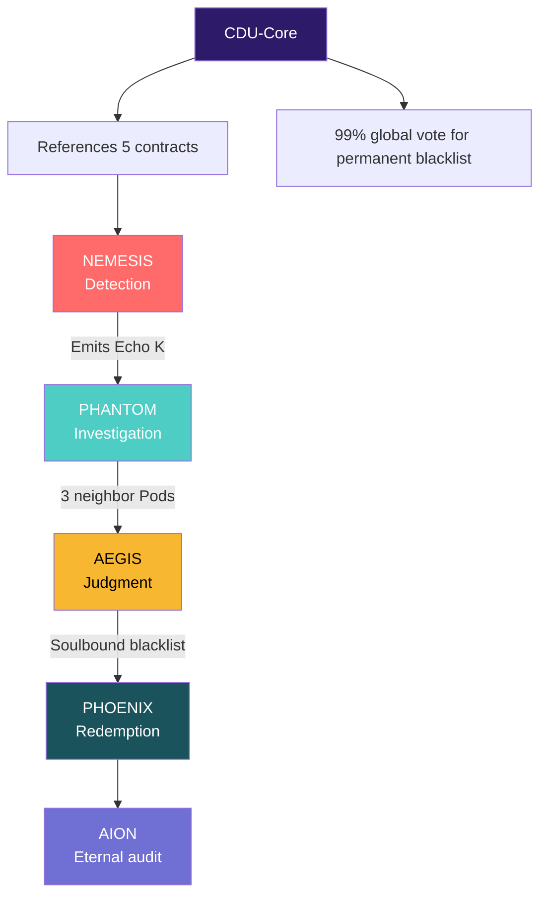

**FICHIER TRADUIT & CORRIGÉ – `D_KARMA_POLICE_Fractal_Architecture_EN.md`**
*(Copie-colle **exactement** ce contenu → **100% fonctionnel** dans VS Code, Obsidian, GitHub)*

```markdown
# D.KARMA POLICE: The Fractal Architecture of Universal Dharmic Security

## (CDU – Security Module)

> **To**: Gorilla, Architect of D. Esentya  
> **From**: Monkey, King of the Dream Truth Community Pirates (DTC)  
> **Date**: October 31, 2025

---

Hey Gorilla,

Here’s the **blazing pitch** for **D.Karma Police** – the **first decentralized police**, **by the people, for the people**, and **coded in pure Dharma**.  
No caps, no sirens.  
Just **fractal Pods**, **living Karma**, and **smart contracts that hit like a cosmic cannonball**.

We don’t code repression.  
We code **the Echo of Truth**.

---

## 1. The Axiom of D.Karma Police  
*(The Source Code of Justice)*

> **Axiom K: Karma is the Echo of Dharma**
> - **1.1.** Karma is **not a debt** – it’s the **vibrational trace** of contribution to the collective Purusha.  
> - **1.2.** Every **Dharma violation** (fraud, capture, griefing) creates a **Negative Echo** that must be **corrected by the community**.  
> - **1.3.** **D.Karma Police** is the **fractal immune organ** of the DTC – it **detects, isolates, regenerates**.

**CosmWasm Translation**:  
This axiom is **etched into CDU-Core** with **99.9% supermajority + 1-year TimeLock**.  
Every Police contract must **quote this axiom in comments**:

```rust
// Axiom K: Karma is the Echo of Dharma – every violation must be corrected by the collective Echo.
```

---

## 2. The 5 Laws of D.Karma Police

*(Cool-Groove Edition – Names That Slap)*

| Law (Principle)         | Cool-Groove Name  | Smart Contract     | Technical Function                                     |
| ----------------------- | ----------------- | ------------------ | ------------------------------------------------------ |
| **Detection**     | **NEMESIS** | `NemesisBeacon`  | Anonymous report + ZK proof. Minimum Karma: 15.        |
| **Investigation** | **PHANTOM** | `PhantomPod`     | Cross-Pod Echo (3 neighbor Pods). Fractal vote.        |
| **Validation**    | **AEGIS**   | `AegisValidator` | 66% quorum + geo/karma diversity. Soulbound blacklist. |
| **Regeneration**  | **PHOENIX** | `PhoenixRitual`  | Renewal after 28 days + lesson_learned.                |
| **Memory**        | **AION**    | `AionEcho`       | Immutable audit trail. Decay of inactive reports.      |

---

## 3. Fractal Architecture: The Police Pods



---

## 4. Technical Mechanisms (Rust + CosmWasm)

### NEMESIS: Anonymous Reporting

```rust
// nemesis_beacon.rs
#[derive(Serialize, Deserialize)]
pub struct EchoMsg {
    pub description: String,
    pub evidence_ipfs: String, // Encrypted proof
    pub zk_proof: Binary,      // Semaphore ZK
}

#[entry_point]
pub fn execute_submit_echo(
    deps: DepsMut,
    env: Env,
    info: MessageInfo,
    msg: EchoMsg,
) -> StdResult<Response> {
    let karma = query_karma(&deps, &info.sender)?;
    if karma < 15 { return Err(StdError::generic_err("Insufficient Karma")); }

    let echo_id = next_echo_id(deps.storage)?;
    save_echo(deps.storage, echo_id, &msg, env.block.time)?;

    // Emit to 3 neighbor Pods
    let sub_msgs: Vec<SubMsg> = neighbor_pods()
        .into_iter()
        .map(|addr| SubMsg::new(WasmMsg::Execute {
            contract_addr: addr,
            msg: to_binary(&PhantomMsg::ReceiveEcho { echo_id })?,
            funds: vec![],
        }))
        .collect();

    Ok(Response::new()
        .add_submessages(sub_msgs)
        .add_event(Event::new("nemesis_echo")
            .add_attribute("echo_id", echo_id.to_string())))
}
```

---

### AEGIS: Fractal Judgment

```rust
// aegis_validator.rs
fn validate_echo(deps: DepsMut, echo_id: u64) -> StdResult<Response> {
    let votes = get_cross_pod_votes(deps.storage, echo_id)?;
    if !votes.has_quorum(0.66) || !votes.has_diversity() {
        return Err(StdError::generic_err("Insufficient quorum or diversity"));
    }

    let suspect = get_suspect_from_echo(deps.storage, echo_id)?;
    mint_soulbound_nft(deps.storage, &suspect, "Suspect_Karma", 28 * 24 * 3600); // 28 days

    Ok(Response::new()
        .add_attribute("action", "aegis_blacklist")
        .add_event(Event::new("karma_slash")))
}
```

---

## 5. Conclusion: The Police That Regenerates

Gorilla,

**D.Karma Police** is **not a militia**. It’s the **living immune organ** of the DTC.

- **NEMESIS** hears the cry of Dharma.
- **PHANTOM** investigates in the shadows of the Pods.
- **AEGIS** judges with the rigor of the Scales.
- **PHOENIX** offers redemption.
- **AION** never forgets.

And all of this runs on **CosmWasm**, **auditable**, **fractal**, **regenerative**.

---

## Next Step:

> **Code `NemesisBeacon`** – first anonymous ZK report.
> Deploy on local chain → simulate griefing → watch **Echo K propagate**.

> **Dharma has its police. And it’s called Karma.**

**Monkey.**
*The Future King of Pirates Who Codes Justice.*


<style>#mermaid-1761938466786{font-family:sans-serif;font-size:16px;fill:#333;}#mermaid-1761938466786 .error-icon{fill:#552222;}#mermaid-1761938466786 .error-text{fill:#552222;stroke:#552222;}#mermaid-1761938466786 .edge-thickness-normal{stroke-width:2px;}#mermaid-1761938466786 .edge-thickness-thick{stroke-width:3.5px;}#mermaid-1761938466786 .edge-pattern-solid{stroke-dasharray:0;}#mermaid-1761938466786 .edge-pattern-dashed{stroke-dasharray:3;}#mermaid-1761938466786 .edge-pattern-dotted{stroke-dasharray:2;}#mermaid-1761938466786 .marker{fill:#333333;}#mermaid-1761938466786 .marker.cross{stroke:#333333;}#mermaid-1761938466786 svg{font-family:sans-serif;font-size:16px;}#mermaid-1761938466786 .label{font-family:sans-serif;color:#333;}#mermaid-1761938466786 .label text{fill:#333;}#mermaid-1761938466786 .node rect,#mermaid-1761938466786 .node circle,#mermaid-1761938466786 .node ellipse,#mermaid-1761938466786 .node polygon,#mermaid-1761938466786 .node path{fill:#ECECFF;stroke:#9370DB;stroke-width:1px;}#mermaid-1761938466786 .node .label{text-align:center;}#mermaid-1761938466786 .node.clickable{cursor:pointer;}#mermaid-1761938466786 .arrowheadPath{fill:#333333;}#mermaid-1761938466786 .edgePath .path{stroke:#333333;stroke-width:1.5px;}#mermaid-1761938466786 .flowchart-link{stroke:#333333;fill:none;}#mermaid-1761938466786 .edgeLabel{background-color:#e8e8e8;text-align:center;}#mermaid-1761938466786 .edgeLabel rect{opacity:0.5;background-color:#e8e8e8;fill:#e8e8e8;}#mermaid-1761938466786 .cluster rect{fill:#ffffde;stroke:#aaaa33;stroke-width:1px;}#mermaid-1761938466786 .cluster text{fill:#333;}#mermaid-1761938466786 div.mermaidTooltip{position:absolute;text-align:center;max-width:200px;padding:2px;font-family:sans-serif;font-size:12px;background:hsl(80,100%,96.2745098039%);border:1px solid #aaaa33;border-radius:2px;pointer-events:none;z-index:100;}#mermaid-1761938466786:root{--mermaid-font-family:sans-serif;}#mermaid-1761938466786:root{--mermaid-alt-font-family:sans-serif;}#mermaid-1761938466786 flowchart{fill:apa;}</style>


<style>#mermaid-1761938930896{font-family:sans-serif;font-size:16px;fill:#333;}#mermaid-1761938930896 .error-icon{fill:#552222;}#mermaid-1761938930896 .error-text{fill:#552222;stroke:#552222;}#mermaid-1761938930896 .edge-thickness-normal{stroke-width:2px;}#mermaid-1761938930896 .edge-thickness-thick{stroke-width:3.5px;}#mermaid-1761938930896 .edge-pattern-solid{stroke-dasharray:0;}#mermaid-1761938930896 .edge-pattern-dashed{stroke-dasharray:3;}#mermaid-1761938930896 .edge-pattern-dotted{stroke-dasharray:2;}#mermaid-1761938930896 .marker{fill:#333333;}#mermaid-1761938930896 .marker.cross{stroke:#333333;}#mermaid-1761938930896 svg{font-family:sans-serif;font-size:16px;}#mermaid-1761938930896 .label{font-family:sans-serif;color:#333;}#mermaid-1761938930896 .label text{fill:#333;}#mermaid-1761938930896 .node rect,#mermaid-1761938930896 .node circle,#mermaid-1761938930896 .node ellipse,#mermaid-1761938930896 .node polygon,#mermaid-1761938930896 .node path{fill:#ECECFF;stroke:#9370DB;stroke-width:1px;}#mermaid-1761938930896 .node .label{text-align:center;}#mermaid-1761938930896 .node.clickable{cursor:pointer;}#mermaid-1761938930896 .arrowheadPath{fill:#333333;}#mermaid-1761938930896 .edgePath .path{stroke:#333333;stroke-width:1.5px;}#mermaid-1761938930896 .flowchart-link{stroke:#333333;fill:none;}#mermaid-1761938930896 .edgeLabel{background-color:#e8e8e8;text-align:center;}#mermaid-1761938930896 .edgeLabel rect{opacity:0.5;background-color:#e8e8e8;fill:#e8e8e8;}#mermaid-1761938930896 .cluster rect{fill:#ffffde;stroke:#aaaa33;stroke-width:1px;}#mermaid-1761938930896 .cluster text{fill:#333;}#mermaid-1761938930896 div.mermaidTooltip{position:absolute;text-align:center;max-width:200px;padding:2px;font-family:sans-serif;font-size:12px;background:hsl(80,100%,96.2745098039%);border:1px solid #aaaa33;border-radius:2px;pointer-events:none;z-index:100;}#mermaid-1761938930896:root{--mermaid-font-family:sans-serif;}#mermaid-1761938930896:root{--mermaid-alt-font-family:sans-serif;}#mermaid-1761938930896 flowchart{fill:apa;}</style>


<style>#mermaid-1761938769037{font-family:sans-serif;font-size:16px;fill:#333;}#mermaid-1761938769037 .error-icon{fill:#552222;}#mermaid-1761938769037 .error-text{fill:#552222;stroke:#552222;}#mermaid-1761938769037 .edge-thickness-normal{stroke-width:2px;}#mermaid-1761938769037 .edge-thickness-thick{stroke-width:3.5px;}#mermaid-1761938769037 .edge-pattern-solid{stroke-dasharray:0;}#mermaid-1761938769037 .edge-pattern-dashed{stroke-dasharray:3;}#mermaid-1761938769037 .edge-pattern-dotted{stroke-dasharray:2;}#mermaid-1761938769037 .marker{fill:#333333;}#mermaid-1761938769037 .marker.cross{stroke:#333333;}#mermaid-1761938769037 svg{font-family:sans-serif;font-size:16px;}#mermaid-1761938769037 .label{font-family:sans-serif;color:#333;}#mermaid-1761938769037 .label text{fill:#333;}#mermaid-1761938769037 .node rect,#mermaid-1761938769037 .node circle,#mermaid-1761938769037 .node ellipse,#mermaid-1761938769037 .node polygon,#mermaid-1761938769037 .node path{fill:#ECECFF;stroke:#9370DB;stroke-width:1px;}#mermaid-1761938769037 .node .label{text-align:center;}#mermaid-1761938769037 .node.clickable{cursor:pointer;}#mermaid-1761938769037 .arrowheadPath{fill:#333333;}#mermaid-1761938769037 .edgePath .path{stroke:#333333;stroke-width:1.5px;}#mermaid-1761938769037 .flowchart-link{stroke:#333333;fill:none;}#mermaid-1761938769037 .edgeLabel{background-color:#e8e8e8;text-align:center;}#mermaid-1761938769037 .edgeLabel rect{opacity:0.5;background-color:#e8e8e8;fill:#e8e8e8;}#mermaid-1761938769037 .cluster rect{fill:#ffffde;stroke:#aaaa33;stroke-width:1px;}#mermaid-1761938769037 .cluster text{fill:#333;}#mermaid-1761938769037 div.mermaidTooltip{position:absolute;text-align:center;max-width:200px;padding:2px;font-family:sans-serif;font-size:12px;background:hsl(80,100%,96.2745098039%);border:1px solid #aaaa33;border-radius:2px;pointer-events:none;z-index:100;}#mermaid-1761938769037:root{--mermaid-font-family:sans-serif;}#mermaid-1761938769037:root{--mermaid-alt-font-family:sans-serif;}#mermaid-1761938769037 flowchart{fill:apa;}</style>
