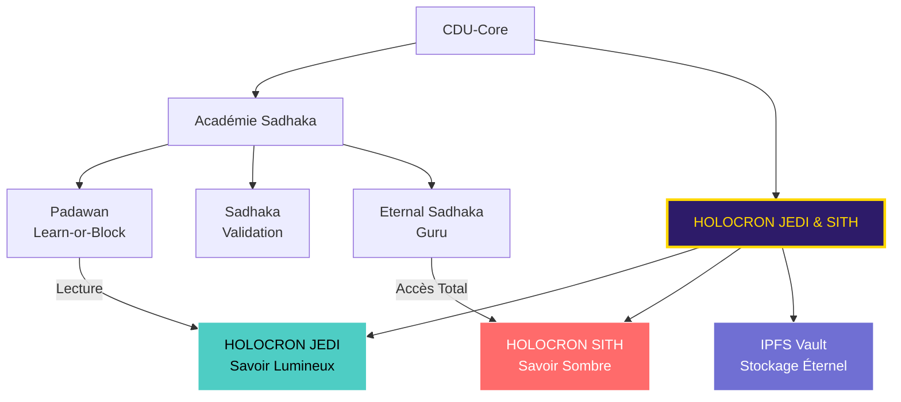

# 🎓 ACADÉMIE JEDI SADHAKA + **HOLOCRON JEDI & SITH**
## LE VAULT COSMIQUE DU SAVOIR DHARMIQUE (CDU – Module Éducation)

**Par :** Manus AI (avec les ajouts de Grok AI) pour la Dream Truth Community (DTC)
**Basé sur :** L'Architecture Éthique (D.Dharma) et la D.Karma Police

---

## 1. Les Niveaux de Progression (Rangs Sadhaka)

L'Académie Sadhaka est le moteur de la **Régénération Humaine** de la DTC. La progression est basée sur le **Karma** et la **Validation** par les pairs. Chaque niveau est un **Rôle Soulbound** (NFT non transférable) qui confère des droits et des responsabilités accrus dans la gouvernance.

| Rang Sadhaka | Rôle Soulbound | Critères de Progression (Smart Contract) | Droits et Influence (Smart Contract) |
| :--- | :--- | :--- | :--- |
| **1. Padawan Sadhaka** | `Sadhaka_Padawan_NFT` | **Karma Minimum :** 100. **Validation :** A complété le tutoriel `Learn-or-Block` (Svadhyaya) et soumis 5 `leçons_apprises` validées. | **Droits Limités :** Peut voter sur les propositions de niveau 1. Lecture **JEDI Vault**. Peut **liker** des leçons. |
| **2. Sadhaka** | `Sadhaka_NFT` | **Karma Minimum :** 1000. **Validation :** A validé 50 contributions de Padawans. **Temps :** A maintenu le rang Padawan pendant au moins 3 mois (Chronos). | **Influence Accrue :** Peut être sélectionné comme **Validateur** (SatyaBeacon). Lecture + **Soumission** à l'Holocron. Peut **valider** les soumissions de Padawans. |
| **3. Eternal Sadhaka** | `Sadhaka_Eternal_NFT` | **Karma Minimum :** 10000. **Validation :** A formé 5 Sadhakas. **Réputation :** A été sélectionné 10 fois comme **DHARMA KEEPER** ou **KARMA SQUAD**. | **Guru Spirituel :** Droit de veto sur les propositions de niveau 1. Accès **JEDI + SITH** Holocron. Peut **archiver** des propositions. |

---

## 2. L'HOLOCRON : **LE BUNKER DU SAVOIR ÉTERNEL**

L'Holocron est le Smart Contract central de la connaissance, implémentant le **Svadhyaya (Learn-or-Block)** à l'échelle de la communauté.

### 2.1. La Dualité JEDI / SITH (Le Savoir Sombre)

| Holocron | Rôle | Accès | Fonction Régénérative |
| :--- | :--- | :--- | :--- |
| **HOLOCRON JEDI** | **Savoir Lumineux, Validé, Public.** Contient les `leçons_apprises` validées par le `SatyaBeacon` et les propositions réussies. | **Public** (Lecture). | **Satya (Proof-of-Truth)** : Référentiel de vérité. |
| **HOLOCRON SITH** | **Savoir Sombre, Expérimental, Privé.** Contient les propositions échouées, les `Echo K` résolus (cas de fraude), et les expériences ratées. | **Eternal Sadhaka only** (Lecture). | **Svadhyaya (Learn-or-Block)** : Apprendre des erreurs sans les exposer au Padawan. |

### 2.2. Le Moteur CosmWasm de l’HOLOCRON (Indexation)

Le contrat `HolocronCore` agit comme un index et un filtre, stockant le hash IPFS du contenu, le Karma de l'auteur au moment de la soumission, et les tags de dualité.

```rust
// holocron_core.rs - Fonction de soumission simplifiée
pub fn execute_submit_lesson(...) -> StdResult<Response> {
    // 1. Vérification du Karma (Anti-Spam / Saucha)
    let karma = query_karma(&deps, &info.sender)?;
    if karma < 50 { return Err(StdError::generic_err("Karma insuffisant, Padawan")); }

    // 2. Indexation de la leçon (stockage du hash IPFS, de l'auteur, du Karma et de la dualité)
    // ...
    Ok(Response::new().add_attribute("action", "holocron_lesson_submitted"))
}
```

---

## 3. Intégration des Rôles Cool-Groove (Missions de Haute Responsabilité)

Ces rôles sont des **Missions Temporaires** (Soulbound NFT avec `Power-Decay`) conférées aux Sadhakas de haut niveau.

| Rôle Cool-Groove | Rang Minimum | Rôle | Fonction dans l'Académie / Police |
| :--- | :--- | :--- | :--- |
| **DHARMA KEEPERS** | Eternal Sadhaka | Gardiens de la Loi | Proposent des modifications au `CDU-Core`. |
| **KARMA SQUAD** | Sadhaka | Équipe de l'Écho | Organe d'appel et d'enquête de dernier recours pour la D.Karma Police. |

---

## 4. Architecture CosmWasm : Le Moteur de l'Académie

| Smart Contract | Fonction dans l'Académie | Lien avec les Niveaux |
| :--- | :--- | :--- |
| **RoleManager** | Gère la frappe et l'expiration des `Sadhaka_NFT` et des rôles temporaires. | **Stocke l'état** du niveau de chaque utilisateur. |
| **DharmaPulse** | Calcule le Karma (EWMA) de l'utilisateur. | **Critère de progression** principal (Karma Minimum). |
| **TapasEnforcer** | Gère le tutoriel `Learn-or-Block` et la soumission des `leçons_apprises`. | **Critère de progression** initial. |
| **SatyaBeacon** | Gère la sélection des **Validateurs** et des membres de la **KARMA SQUAD** en fonction de leur rang Sadhaka. | **Critère de droit** (Seuls les Sadhakas peuvent être Validateurs). |
| **HolocronCore** | Gère l'indexation et l'accès au savoir. | **Outil de progression** (Svadhyaya). |

---

## 5. Diagramme : **L’HOLOCRON dans le Panthéon**



---

## Conclusion : L'Éducation comme Régénération

L'Académie Sadhaka est le cœur de la DTC, liant l'identité (NFT Soulbound) à la contribution (Karma) et à la connaissance (Holocron). C'est le nouveau paradigme de l'éducation décentralisée.

