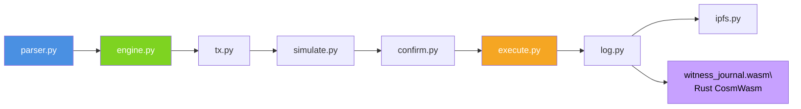

# 🚀 Roadmap de Développement – MVP Essentios (14 jours)

Essentios est un **assistant LLM local** pour l’écosystème **Cosmos**.
Ce document résume les **phases de développement**, les **modules à coder**, et les **fichiers clés** du projet.

---

## 📆 Vue synthétique (14 jours)

| Jour         | Module / Composant            | Description principale                                                                          | Langage / Dossier |
| ------------ | ----------------------------- | ----------------------------------------------------------------------------------------------- | ----------------- |
| **1**  | Setup projet                  | Init repo Git, structure `cli/` (Python) & `contracts/` (Rust CosmWasm), config Juno local. | —                |
| **2**  | `contracts/witness_journal` | Contrat CosmWasm minimal :`InstantiateMsg`, `AppendLog`, `GetLogs`.                       | Rust              |
| **3**  | `cli/core/client.py`        | Client RPC/GRPC Cosmos via `cosmpy`, test de connexion.                                       | Python            |
| **4**  | `cli/core/parser.py`        | Parsing du langage naturel → JSON `intent_schema.json`.                                      | Python            |
| **5**  | `cli/llm/engine.py`         | Intégration Llama2 (via `ollama`) pour conversion NL → Tx JSON.                             | Python            |
| **6**  | `cli/core/tx.py`            | Génération de transactions Cosmos (`MsgSend`, `MsgDelegate`).                             | Python            |
| **7**  | `cli/core/simulate.py`      | Simulation “dry-run” RPC + gestion des erreurs.                                               | Python            |
| **8**  | `cli/core/confirm.py`       | Interface confirmation `[Y/N]` + affichage diff Tx.                                           | Python            |
| **9**  | `cli/core/execute.py`       | Signature + broadcast via keyring local.                                                        | Python            |
| **10** | `cli/core/log.py`           | Appel CosmWasm : journalisation des Tx sur `witness_journal`.                                 | Python            |
| **11** | `cli/memory/ipfs.py`        | Persistance Off-chain sur IPFS local.                                                           | Python            |
| **12** | `cli/ui/summary.py`         | Résumé textuel des actions réalisées (log de session).                                      | Python            |
| **13** | Tests intégrés              | Scénario complet :*"Stake 10 ATOM chez X"* → simulation → broadcast → log.                | —                |
| **14** | Documentation / Audit         | README technique, schéma modules, nettoyage code.                                              | —                |

---

## 🧠 Semaine 1 – Fondations & IA locale (Jour 1–7)

### 🎯 Objectif :

Mettre en place les **bases logicielles** : structure du repo, LLM local, parsing et simulation.

### 🔧 Étapes de code :

| Étape                 | Fichier(s)                         | Description                                                   | Notes                                   |
| ---------------------- | ---------------------------------- | ------------------------------------------------------------- | --------------------------------------- |
| 1. Setup projet        | `cli/`, `contracts/`           | Initialiser environnement Python + Rust.                      | `python -m venv venv`, `cargo init` |
| 2. Contrat journal     | `contracts/witness_journal/src/` | Définir structure `LogEntry`, exécution `AppendLog`.    | Utiliser CosmWasm 1.2                   |
| 3. Client RPC          | `cli/core/client.py`             | Wrapper `cosmpy` pour `get_balance`, `simulate_tx`.     | Appel `http://localhost:26657`        |
| 4. Parsing NL          | `cli/core/parser.py`             | Traduire phrase → JSON avec schéma d’intention.            | Exemple :`"Stake 10 ATOM chez X"`     |
| 5. LLM Local           | `cli/llm/engine.py`              | Implémenter fonction `generate_tx(intent)` via `ollama`. | Modèle :`llama2:7b`                  |
| 6. Transaction Builder | `cli/core/tx.py`                 | Construire `MsgSend`, `MsgDelegate`.                      | Import `cosmpy.tx`                    |
| 7. Simulation          | `cli/core/simulate.py`           | Simuler transaction (dry-run RPC).                            | Vérifie gas & validité JSON           |

---

## 🔐 Semaine 2 – Sécurité, Signature et Transparence (Jour 8–14)

### 🎯 Objectif :

Relier le cœur IA aux mécanismes on-chain et à la mémoire persistante.

### 🔧 Étapes de code :

| Étape                    | Fichier(s)                   | Description                                       | Notes                         |
| ------------------------- | ---------------------------- | ------------------------------------------------- | ----------------------------- |
| 8. Confirmation           | `cli/core/confirm.py`      | Prompt Y/N avant signature.                       | `click.confirm("Signer ?")` |
| 9. Signature & Broadcast  | `cli/core/execute.py`      | Envoi via `keyring` ou `cosmpy.broadcast_tx`. | Ledger ou local keyring       |
| 10. Journal On-chain      | `cli/core/log.py`          | Envoi du hash/TxID au contrat CosmWasm.           | `AppendLog{tx_id, msg}`     |
| 11. Mémoire Off-chain    | `cli/memory/ipfs.py`       | Envoi du log complet vers IPFS + retour hash.     | `ipfshttpclient`            |
| 12. Interface utilisateur | `cli/ui/summary.py`        | Afficher résumé NL des actions exécutées.     | Historique utilisateur        |
| 13. Tests                 | `tests/test_end_to_end.py` | Exécution complète d’un scénario.             | Pytest + mock RPC             |
| 14. Documentation         | `/docs`                    | Générer README, schéma et API CLI.             | `mkdocs` ou `mdbook`      |

---

## 📂 Structure cible du projet

essentios/

├── cli/

│   ├── main.py              # Entrée CLI

│   ├── core/

│   │   ├── client.py        # Connexion RPC/GRPC Cosmos

│   │   ├── parser.py        # Parsing NL → Intent JSON

│   │   ├── tx.py            # Construction & simulation Tx

│   │   ├── simulate.py      # Dry-run RPC

│   │   ├── confirm.py       # Confirmation Y/N

│   │   ├── execute.py       # Signature & broadcast

│   │   ├── log.py           # Journal on-chain (CosmWasm)

│   ├── llm/

│   │   └── engine.py        # LLM local via Ollama

│   ├── memory/

│   │   └── ipfs.py          # Sauvegarde Off-chain

│   ├── ui/

│   │   └── summary.py       # Interface CLI lisible

│   └──  **init** .py

└── contracts/

└── witness_journal/

├── src/

│   ├── contract.rs

│   ├── msg.rs

│   ├── state.rs

└── Cargo.toml



> 🧭 **Flux clair :**
>
> 1. Langage naturel → parsing → JSON → simulation
> 2. Confirmation → signature → broadcast
> 3. Logging → IPFS + Contrat CosmWasm

---

## ✅ Objectif fin de MVP (Jour 14)

* [X] CLI fonctionnelle (`essentios`)
* [X] LLM local (Llama2 7B)
* [X] Contrat CosmWasm `witness_journal.wasm`
* [X] Transaction complète (stake / DAO)
* [X] Log on-chain + mémoire off-chain
* [X] Documentation technique prête

---

> **Essentios** — L’agent LLM on-chain pour Cosmos : *local, transparent, et sous contrôle humain.*

```

```

<style>#mermaid-1762547024780{font-family:sans-serif;font-size:16px;fill:#333;}#mermaid-1762547024780 .error-icon{fill:#552222;}#mermaid-1762547024780 .error-text{fill:#552222;stroke:#552222;}#mermaid-1762547024780 .edge-thickness-normal{stroke-width:2px;}#mermaid-1762547024780 .edge-thickness-thick{stroke-width:3.5px;}#mermaid-1762547024780 .edge-pattern-solid{stroke-dasharray:0;}#mermaid-1762547024780 .edge-pattern-dashed{stroke-dasharray:3;}#mermaid-1762547024780 .edge-pattern-dotted{stroke-dasharray:2;}#mermaid-1762547024780 .marker{fill:#333333;}#mermaid-1762547024780 .marker.cross{stroke:#333333;}#mermaid-1762547024780 svg{font-family:sans-serif;font-size:16px;}#mermaid-1762547024780 .label{font-family:sans-serif;color:#333;}#mermaid-1762547024780 .label text{fill:#333;}#mermaid-1762547024780 .node rect,#mermaid-1762547024780 .node circle,#mermaid-1762547024780 .node ellipse,#mermaid-1762547024780 .node polygon,#mermaid-1762547024780 .node path{fill:#ECECFF;stroke:#9370DB;stroke-width:1px;}#mermaid-1762547024780 .node .label{text-align:center;}#mermaid-1762547024780 .node.clickable{cursor:pointer;}#mermaid-1762547024780 .arrowheadPath{fill:#333333;}#mermaid-1762547024780 .edgePath .path{stroke:#333333;stroke-width:1.5px;}#mermaid-1762547024780 .flowchart-link{stroke:#333333;fill:none;}#mermaid-1762547024780 .edgeLabel{background-color:#e8e8e8;text-align:center;}#mermaid-1762547024780 .edgeLabel rect{opacity:0.5;background-color:#e8e8e8;fill:#e8e8e8;}#mermaid-1762547024780 .cluster rect{fill:#ffffde;stroke:#aaaa33;stroke-width:1px;}#mermaid-1762547024780 .cluster text{fill:#333;}#mermaid-1762547024780 div.mermaidTooltip{position:absolute;text-align:center;max-width:200px;padding:2px;font-family:sans-serif;font-size:12px;background:hsl(80,100%,96.2745098039%);border:1px solid #aaaa33;border-radius:2px;pointer-events:none;z-index:100;}#mermaid-1762547024780:root{--mermaid-font-family:sans-serif;}#mermaid-1762547024780:root{--mermaid-alt-font-family:sans-serif;}#mermaid-1762547024780 flowchart{fill:apa;}</style>
