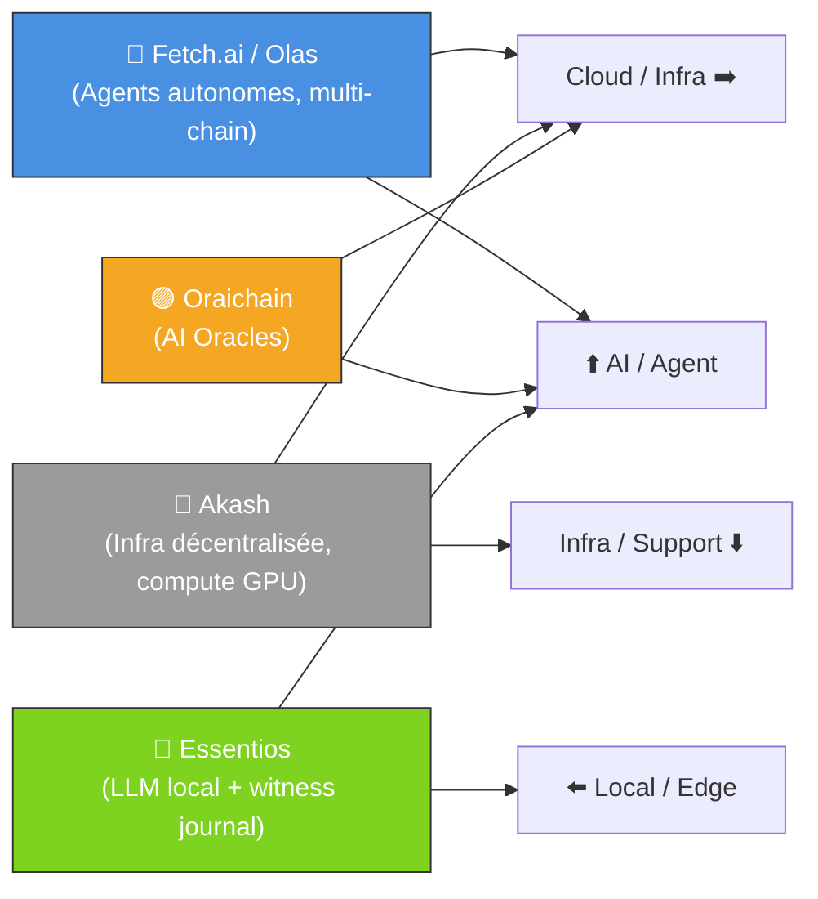
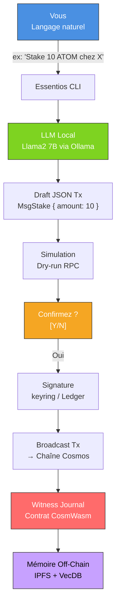

🧩 Résumé MVP **Essentios** – L'Agent LLM On-Chain pour Cosmos

**Essentios** est un **assistant IA local** qui convertit vos commandes en langage naturel (ex :  *"Stake 10 ATOM chez Validateur X"* ) en  **transactions Cosmos sécurisées** , avec :

* ✅  **Confirmation humaine obligatoire** ,
* 🔐  **Exécution locale et privée** ,
* 🪶  **Journal on-chain immuable** .

> **Vision** : un *cerveau blockchain* privé, transparent et sous contrôle humain.
>
> **MVP (14 jours)** : 100 % local, testé sur chaîne Juno, avec journal témoin on-chain.

---

## 🔍 Benchmark – Paysage des Agents & AI On-Chain

| Projet                                | Description                                    | Cosmos | Local LLM | Spécificité                                             |
| :------------------------------------ | :--------------------------------------------- | :----- | :-------- | :-------------------------------------------------------- |
| **TXT2TXN (Circle)**            | Convertit texte → transaction (intents)       | ❌     | ❌        | Simple schéma JSON + confirmation manuelle               |
| **Fetch.ai / Olas (Autonolas)** | Marché d’agents autonomes multi-chaînes     | ✅     | ❌        | Agents persistants avec identités NFT et gouvernance DAO |
| **Oraichain**                   | Oracle AI Layer-1 sur Cosmos                   | ✅     | ❌        | Bridge entre API IA et smart-contracts CosmWasm           |
| **Akash**                       | Cloud décentralisé (GPU/compute)             | ✅     | ❌        | Infrastructure d’exécution IA décentralisée           |
| **DAO DAO**                     | Stack CosmWasm pour DAO on-chain               | ✅     | ❌        | Gouvernance décentralisée (cw3/cw4)                     |
| **Allora Network**              | IA collaborative on-chain (zkML)               | ✅     | ❌        | Validation collective des modèles                        |
| **Essentios (MVP)**             | **Assistant IA personnel Cosmos-native** | ✅     | ✅        | **Local + Sécurisé + Audit on-chain**             |

🧠 **Différenciation claire :**

* Exécution **locale (LLM offline)** → confidentialité totale.
* Journal **CosmWasm on-chain** → traçabilité et immutabilité.
* **Human-in-the-loop** → aucune action sans consentement.
* **Cosmos-native** → interopérable, rapide et open-source.

## Positionnement Stratégique (Vue 2×2)

---

## ⚙️ Architecture (Code → Actiongraph TD

🔑 **Lecture du flux :**

1. L’utilisateur décrit une intention en français.
2. L’agent (LLM local) génère un  **brouillon JSON Cosmos** .
3. Simulation du TX →  **dry-run sécurisé** .
4. L’utilisateur confirme.
5. Signature (Ledger / keyring).
6. Transaction broadcastée → chaîne Cosmos.
7. **Log immuable** dans le contrat `witness_journal`.
8. Sauvegarde contextuelle off-chain (IPFS + vector DB).

---

## 🗺 **Roadmap MVP – 14 Jours**

```mermaid
gantt
    title Roadmap MVP Essentios
    dateFormat D

    section Phase 1
    Setup projet et chaîne locale :done, 1, 2
    Contrat Witness Journal :done, 2, 3

    section Phase 2
    CLI et Brouillon Tx :done, 4, 4
    Intégration LLM Local :done, 5, 5
    Exécution Tx et Confirmation :done, 6, 6

    section Phase 3
    Journal On-Chain :done, 7, 7
    Démo DAO Proposal :done, 8, 8
    Requête État Chaîne :done, 9, 9

    section Phase 4
    Mémoire Off-Chain IPFS :active, 10, 11
    Filtres Sécurité :active, 12, 12
    Docs et Audit Interne :active, 13, 14

```

📌 **Lien entre benchmark, code et roadmap :**

* Le **benchmark** montre le vide entre oracles, clouds et agents autonomes : aucun ne combine  **local LLM + Cosmos + sécurité humaine** .
* L’**architecture** traduit cette vision en pipeline clair et traçable.
* La **roadmap** déploie en 14 jours un prototype complet : CLI, LLM local, contrat témoin, log et test sur chaîne Juno.

---

## ✅ **Livrables MVP (Jour 14)**

| Livrable                          | Statut |
| :-------------------------------- | :----- |
| CLI `essentios`fonctionnelle    | ✅     |
| LLM local (Llama 2 7B via Ollama) | ✅     |
| Contrat `witness_journal.wasm`  | ✅     |
| TX staking / DAO proposal         | ✅     |
| Mémoire on-chain + off-chain     | ✅     |
| Filtres sécurité / confirmation | ✅     |
| Documentation & Runbook           | ✅     |

---

> **Essentios** : *Votre assistant blockchain – intelligent, local, transparent et sous contrôle humain.*
